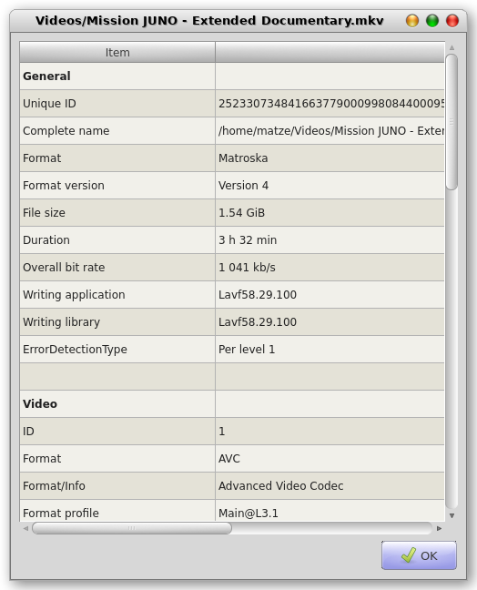
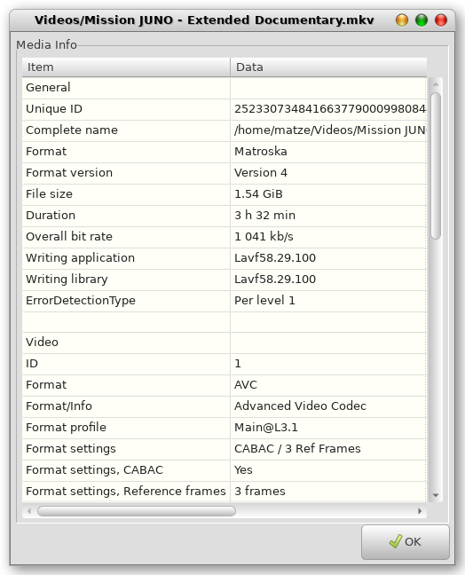

# MediaInfoGui
QT5 GUI for MediaInfo data

Version 1.2.0

This simple GUI for the media info binary runs on linux. Provides a fast & clean overview of the contents of a mediafile

##### QT5 Implementation

##### GTK3 Implementation

### Features
Opens on a given filename, usually from a filemanger. Shows the codec data of video, audio and images

### Prerequisites
 python3-qt5 (pyqt5)
 mediainfo
 
### How to install
 * Download the MediaInfoGui*.tar contained in the "build" folder 
 * Unpack it and run the command  **sudo ./install.sh** in the unpacked folder.
 * Select 1 for QT5 and 2 for GTK3 
 * Install just copies a desktop file and some python scripts to /usr/local/sbin/MediaInfoGui
 
